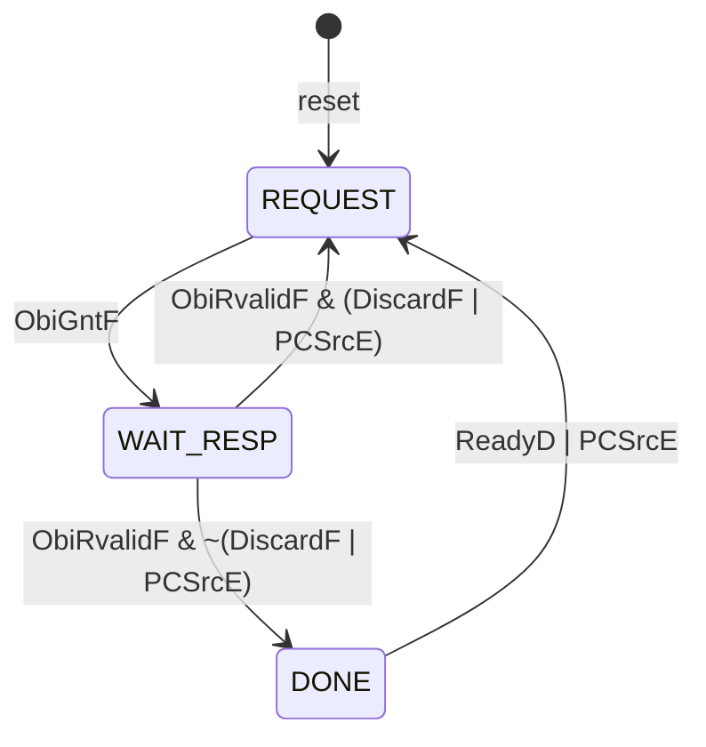

# IFU — Instruction Fetch Unit (F stage)

The IFU is the first stage of the HIPV pipeline. It holds the program counter, fetches
instructions from memory over an OBI master port, and hands each fetched instruction to
the Decode stage through a valid/ready handshake.

Files: `rtl/core/ifu/ifu.sv` (structural datapath), `rtl/core/ifu/ifuctrl.sv`
(behavioral control FSM). Testbench: `tb/unit/ifu/`.

## Block diagram

```
                 PCSrcE ────────────┐
                 PCTargetE ──────┐  │
                                 v  v
                  ┌────────┐   ┌──────┐   PCNextF   ┌─────────┐  PCF
     PCPlus4F ───>│        │──>│ mux2 │────────────>│ flopenr │────────┬──> ObiAddrF
                  │ adder  │   └──────┘             │  pcreg  │        │
            4 ───>│ pcadd4 │            PCEnF ─────>│         │        ├──> PCF (out)
                  └────────┘                        └─────────┘        │
                       ^───────────────────────────────────────────────┘
                                                    ┌──────────┐
     ObiRdataF ────────────────────────────────────>│ flopenr  │──> InstrF
                                        InstrEnF ──>│ instrreg │
                                                    └──────────┘
     ┌─────────────────────────────────────────────────────────────────┐
     │ ifuctrl:  ObiGntF, ObiRvalidF, ReadyD, PCSrcE                   │
     │       ──> ObiReqF, PCEnF, InstrEnF, ValidF                      │
     └─────────────────────────────────────────────────────────────────┘
```

## Ports

| Port         | Dir | Width | Description                                            |
|--------------|-----|-------|--------------------------------------------------------|
| `clk`        | in  | 1     | Clock                                                  |
| `reset`      | in  | 1     | Synchronous, active-high; clears PC to 0               |
| `ReadyD`     | in  | 1     | Decode stage accepts the current instruction           |
| `ValidF`     | out | 1     | Stage output (`InstrF`, `PCF`, `PCPlus4F`) is valid    |
| `PCSrcE`     | in  | 1     | Redirect: load PC from `PCTargetE` (branch/jump taken) |
| `PCTargetE`  | in  | 32    | Branch/jump target from the Execute stage              |
| `InstrF`     | out | 32    | Fetched instruction                                    |
| `PCF`        | out | 32    | PC of `InstrF`                                         |
| `PCPlus4F`   | out | 32    | `PCF + 4`                                              |
| `ObiReqF`    | out | 1     | OBI address-phase request                              |
| `ObiGntF`    | in  | 1     | OBI address-phase grant                                |
| `ObiAddrF`   | out | 32    | OBI fetch address (= `PCF`)                            |
| `ObiRvalidF` | in  | 1     | OBI response valid                                     |
| `ObiRdataF`  | in  | 32    | OBI response data (instruction)                        |

## OBI interface

The IFU implements the read-only OBI subset used by the CV32E40P instruction interface.
A transaction has two phases: the address phase (`ObiReqF` held high with `ObiAddrF`
until the slave asserts `ObiGntF`) and the response phase (`ObiRvalidF` with `ObiRdataF`,
at least one cycle after the grant). Write-related signals (`we`, `be`, `wdata`) are
omitted; the SoC ties them off at the top level. The IFU keeps at most one transaction
outstanding.

## Valid/ready handshake to Decode

`ValidF` is asserted when a fetched instruction is present on `InstrF`/`PCF`/`PCPlus4F`
and stays asserted, with stable outputs, until Decode asserts `ReadyD` (same-cycle
handshake: the transfer happens on the clock edge where both are high). Deasserting
`ReadyD` therefore back-pressures the fetch stage; this replaces the classic `StallF`
signal. A redirect (`PCSrcE`) gates `ValidF` off combinationally so a flushed
instruction is never handed to Decode.

## Control FSM (`ifuctrl`)



| State       | Outputs                                | Meaning                          |
|-------------|----------------------------------------|----------------------------------|
| `REQUEST`   | `ObiReqF = 1`                          | Waiting for grant                |
| `WAIT_RESP` | `InstrEnF = rvalid & ~stale`           | Waiting for response             |
| `DONE`      | `ValidF = ~PCSrcE`, `PCEnF` on `ReadyD`| Presenting instruction to Decode |

`PCEnF = PCSrcE | (DONE & ReadyD)` — the PC advances when Decode consumes the
instruction (to `PCPlus4F`) or immediately on a redirect (to `PCTargetE`).

### Redirect handling

A redirect can arrive in any state. In `DONE` the pending instruction is silently
dropped (`ValidF` gated off). If a memory transaction is outstanding (`WAIT_RESP`, or
`REQUEST` in the same cycle as `ObiGntF`), the sticky `DiscardF` flag is set; when the
stale response arrives it is discarded instead of captured, and fetching restarts from
the new PC.

## Timing

Sequential fetch with a zero-wait-state memory (`gnt` immediate, `rvalid` one cycle
later) takes 3 cycles per instruction:

```
cycle      :  1        2          3      4        5          6
State      :  REQUEST  WAIT_RESP  DONE   REQUEST  WAIT_RESP  DONE
ObiReqF    :  1        0          0      1        0          0
ObiGntF    :  1        0          0      1        0          0
ObiRvalidF :  0        1          0      0        1          0
ValidF     :  0        0          1      0        0          1
PCF        :  0        0          0      4        4          4
```

## Known simplifications

These are deliberate, to keep the first version teachable; each is a natural
extension for a later lecture.

- One outstanding transaction, no prefetch buffer: throughput is 1 instruction per
  3 cycles even with an ideal memory. A prefetch/skid buffer restores 1 instr/cycle.
- A redirect during `REQUEST` before `ObiGntF` changes `ObiAddrF` while `ObiReqF` is
  high; strict OBI requires a stable address phase. Simple memories tolerate this.
- No misaligned-fetch or bus-error handling; no compressed (16-bit) instructions.
- Reset vector fixed at `0x00000000` (parameterization comes with the config package).

## Verification

`tb/unit/ifu/test_ifu.py` models the OBI slave in Python with configurable grant and
response latency and checks: first fetch from address 0, sequential fetch, output
stability under backpressure (`ReadyD = 0`), redirect from `DONE`, discard of a stale
response on a mid-fetch redirect, and operation with a slow memory. Run with
`make` in `tb/unit/ifu` (`SIM_BUILD=/tmp/...` if the repo is on a synced drive).
